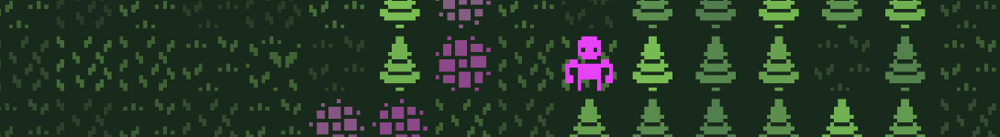
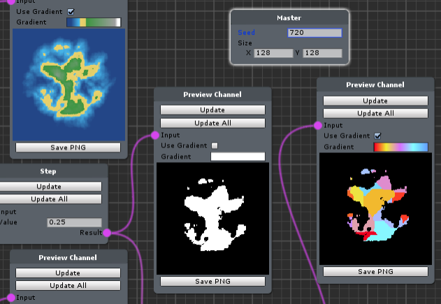

### Hello there 👋

My name is Kyle, and I'm a Technical Artist / UI Developer / Team Lead at a mobile game studio in Toronto.   I spend most of my workday 

- 🛠 developing tools, 

- 👨‍🔧 managing the asset pipeline, 

- 🖼 writing shaders, 

- 📏 and profiling our game.  

When I manage to avail myself of some free time, I try to dive into topics that don't come up as often during my day job.  You can take a look at some of my favourite projects below.  

In 2020, I'm hoping to

- 🐦 Start building something neat with my friends at Boss Chamber,

- ✏ Shore up my traditional art fundamentals,

- 🐵 Dipping my toes in 3D with Blender,

- 🗺 and Continuing to chip away at KPDRL, my lo-fi roguelike framework.

### Past & Present Projects ⌚

#### KPDRL

[KPDRL](https://github.com/KPDwyer/KPDRL) is a small framework I'm working on for building roguelike inspired games.

KPDRL has a unique, node-based map generator - check out [this twitter thread](https://twitter.com/_KPDwyer/status/1204466766530957314) for more.